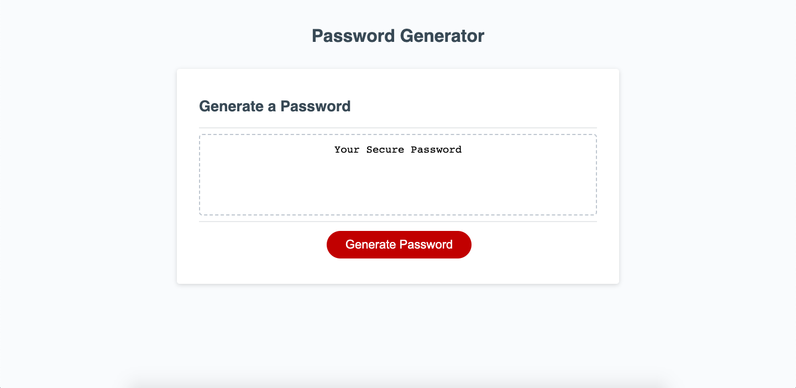

# Password Generator Application

## Description
This is a password generator web app that will ask a few questions to construct a password, then display the password in the main text area.  It was a homework project designed to apply the JavaScript we have learned to date.  It uses concatenation, a for loop, and randomization, among other JavaScript codes. (Note that for this app to run correctly, it must be reloaded between password generations.)

## Screenshot

## Credits
I did not write the source code for this project.  It may be found here: [Link to soure code on GitHub](https://github.com/coding-boot-camp/friendly-parakeet)

## Link
[Link to deployed app](https://tavonns.github.io/password-generator-app)

## License
MIT License